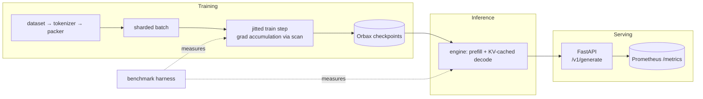

# JAXScale-LM

**A JAX/XLA training and inference systems lab.** A small decoder-only
Transformer language model, built from first principles with Flax NNX, that
exists to demonstrate ML *systems* engineering: XLA compilation behavior,
data/model sharding on a device mesh, mixed precision, gradient
accumulation, exact checkpoint resumption, KV-cached autoregressive
inference, a measured serving stack, and a benchmark harness that refuses
to lie.

Model quality is explicitly a non-goal; every design decision optimizes for
demonstrating how modern JAX-based ML systems work, reproducibly, on
hardware as small as a laptop CPU.

> This is an independent educational project. It demonstrates concepts used
> in modern JAX-based ML systems and has no affiliation with Google
> DeepMind or any other organization.

## Why JAX for ML systems

JAX makes the systems layer *explicit* where most frameworks hide it:
compilation is a visible step (`jax.jit`) with measurable cost and a
shape-keyed cache; device placement and sharding are values you pass
around (`NamedSharding`), not global flags; randomness is a key you thread,
not hidden state; and asynchronous dispatch forces you to be honest about
what a timer measures. That makes JAX an ideal vehicle for *teaching and
measuring* the mechanics — tracing, recompilation, collectives, fixed-shape
decoding — that determine real training and serving performance. See
[docs/jax_concepts.md](docs/jax_concepts.md).

## Architecture



Full diagrams (training, inference, serving, distributed layout, checkpoint
and registry lifecycles): [docs/architecture.md](docs/architecture.md).

## Main capabilities

- Decoder-only Transformer (RoPE, pre-norm RMSNorm, optional GQA config) in Flax NNX
- Single-device and mesh-based data-parallel training (`data`/`model` axes)
- Mixed precision with separate parameter/compute dtypes; float32 reductions
- Gradient accumulation that is *provably* equivalent to large-batch updates
- Orbax checkpointing with exact resumption (params + optimizer + step + RNG)
- KV-cached generation with prefill/decode separation and a naive baseline
- FastAPI serving with model registry, warmup-before-ready, Prometheus metrics
- A benchmark harness producing JSONL + CSV + Markdown + PNG plots with
  full environment disclosure

## Installation

Requires [uv](https://docs.astral.sh/uv/) (manages Python 3.12 and the
locked environment):

```bash
git clone <this-repo> && cd JAXScale-LM
make install          # one-time environment sync (re-run after dependency changes)
uv run --no-sync python scripts/inspect_devices.py
```

`make install` is the project's single sync point; all Makefile targets run
with `uv run --no-sync` against that environment. (This also sidesteps a
macOS quirk where a re-sync can mark venv files `UF_HIDDEN`, which
Python ≥ 3.12.4 treats as a reason to skip `.pth` files — if imports ever
fail with `ModuleNotFoundError: jaxscale_lm`, re-run `make install`.)

## CPU smoke test (~1 minute total)

```bash
make train-smoke      # 10 steps on deterministic synthetic data
make evaluate-smoke   # token-weighted loss / perplexity / accuracy
make generate-smoke   # greedy generation with the KV cache
make benchmark-smoke  # quick benchmark sweep -> artifacts/benchmarks/
make serve            # serve the smoke checkpoint on :8000
```

## Commands

Training:

```bash
uv run --no-sync python scripts/download_data.py  --config configs/train/cpu_smoke.yaml
uv run --no-sync python scripts/train_tokenizer.py --config configs/train/single_device.yaml
uv run --no-sync python scripts/train.py          --config configs/train/cpu_smoke.yaml
```

Resume exactly from the latest (or a specific) checkpoint:

```bash
uv run --no-sync python scripts/train.py --config configs/train/single_device.yaml --resume latest
uv run --no-sync python scripts/train.py --config configs/train/single_device.yaml --resume 200
```

Evaluation:

```bash
uv run --no-sync python scripts/evaluate.py --checkpoint artifacts/checkpoints/cpu_smoke/latest
```

Generation (cached vs naive):

```bash
uv run --no-sync python scripts/generate.py \
  --checkpoint artifacts/checkpoints/cpu_smoke/latest \
  --prompt "Once upon a time" --max-new-tokens 64 --use-kv-cache

uv run --no-sync python scripts/generate.py \
  --checkpoint artifacts/checkpoints/cpu_smoke/latest \
  --prompt "Once upon a time" --max-new-tokens 64 --no-kv-cache
```

Serving:

```bash
uv run --no-sync python scripts/serve.py \
  --checkpoint artifacts/checkpoints/cpu_smoke/latest --host 127.0.0.1 --port 8000
```

Benchmarks:

```bash
uv run --no-sync python scripts/benchmark.py --config configs/benchmark/default.yaml
uv run --no-sync python scripts/benchmark.py --config configs/benchmark/default.yaml --quick
```

Checkpoint inspection:

```bash
uv run --no-sync python scripts/verify_checkpoint.py \
  --checkpoint artifacts/checkpoints/cpu_smoke/latest --restore
```

Docker (CPU serving image; mount a trained checkpoint under `/app/artifacts`):

```bash
make docker-build
docker compose up -d     # serving on :8000 + Prometheus on :9090
curl -i localhost:8000/ready
docker compose down
```

Verified 2026-06-11 on a native linux/arm64 image (Apple-Silicon host):
the standalone image (~361 MB) builds and serves `/health` and `/metrics`
(200) and correctly reports `/ready` 503 with no checkpoint; under Docker
Compose with the smoke checkpoint mounted, Orbax restores step 10
(115,200 parameters), warmup completes in ~0.8 s, `/ready` returns 200
with the model loaded, Prometheus scrapes `/metrics`, and the stack shuts
down cleanly.

## Example API request

```bash
curl -s localhost:8000/v1/generate \
  -H 'content-type: application/json' \
  -d '{
        "prompt": "Once upon a time",
        "max_new_tokens": 32,
        "do_sample": true,
        "temperature": 0.8,
        "top_k": 50,
        "seed": 7,
        "use_kv_cache": true
      }' | python -m json.tool
```

The response includes the text, token ids, prompt/generated token counts,
prefill/decode/total latency, time-to-first-token, tokens/second, model id,
checkpoint step, device platform, and precision. Health: `GET /health`,
readiness (model loaded *and* warm): `GET /ready`, metrics:
`GET /metrics`.

## Tests

```bash
make test              # fast CPU unit tests
make test-integration  # train/checkpoint-resume/serving integration tests
make test-all          # everything CPU-capable, incl. simulated multi-device
make lint typecheck    # ruff + pyright
```

Markers: `unit`, `integration`, `slow`, `accelerator`, `multi_device`.
Multi-device tests run in a subprocess with
`XLA_FLAGS=--xla_force_host_platform_device_count=8` (simulated CPU
devices; sharding logic only, never performance claims).

## Benchmark methodology

Every number: warmup → `block_until_ready`-bounded repetitions → raw
samples preserved → mean/median/std/percentiles; first-call (compile)
timed separately from steady state; failures recorded, not dropped; git
commit + library versions + device inventory embedded in every record.
Details and the list of valid/invalid comparisons:
[docs/benchmarking.md](docs/benchmarking.md).

## Current measured results

See [docs/results.md](docs/results.md) — generated exclusively from real
benchmark runs (`scripts/benchmark.py`) on the hardware disclosed there.
No number in this repository is estimated or copied from elsewhere.

## Hardware disclosure

All recorded results in this repository were measured on a single
Apple-Silicon CPU (macOS, 12 cores) on the CPU backend of JAX. There are no
GPU/TPU measurements here; multi-device tests use simulated CPU devices and
are labeled as such. See [docs/limitations.md](docs/limitations.md).

## Limitations

Honest and explicit: tiny models, CPU-only measurements, serialized
serving (no dynamic batching), per-prompt-length prefill compiles,
equal-length batched generation, simulated multi-device testing.
Full list with rationale: [docs/limitations.md](docs/limitations.md).

## Roadmap

Grouped-query attention, prompt bucketing, tensor parallelism on the
`model` axis, activation checkpointing, dynamic batching, paged KV cache,
speculative decoding, LoRA — ordered list in
[docs/limitations.md](docs/limitations.md#roadmap-optional-extensions-in-rough-order-of-value).

## Repository structure

```
configs/            model presets, train/inference/benchmark configs (YAML + defaults composition)
src/jaxscale_lm/
  config.py         typed, validated configuration (Pydantic)
  data/             tokenizers, sources, packing, deterministic loader
  model/            embeddings+RoPE, attention, MLP, blocks, transformer, KV cache
  training/         loss, optimizer, jitted step, metrics, Orbax checkpoints, trainer
  distributed/      mesh, partitioning, placement, diagnostics
  inference/        sampling, prefill, decode, generation, engine
  serving/          FastAPI app, schemas, registry, lifecycle, Prometheus metrics
  benchmark/        schema, suites, memory probe, runner, plots
scripts/            CLI entry points (all support --help)
tests/              unit / integration / regression (markers: unit, integration, slow, accelerator, multi_device)
docs/               architecture, JAX concepts, sharding, benchmarking, reproducibility, limitations, results
dashboards/         Prometheus scrape config (+ Grafana pointers)
artifacts/          run outputs (gitignored): checkpoints, benchmarks, data caches
```

## License

MIT — see [LICENSE](LICENSE).
