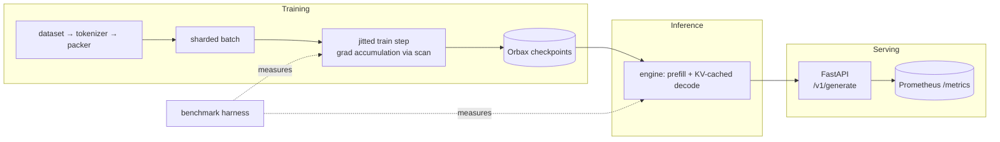

# JAXScale-LM

**A JAX/XLA training and inference systems lab.** A small decoder-only
Transformer language model, built from first principles with Flax NNX, that
exists to demonstrate ML *systems* engineering: XLA compilation behavior,
data/model sharding on a device mesh, mixed precision, gradient
accumulation, exact checkpoint resumption, KV-cached autoregressive
inference, a measured serving stack, and a benchmark harness that refuses
to lie.

Model quality is explicitly a non-goal; every design decision optimizes for
demonstrating how modern JAX-based ML systems work, reproducibly, on
hardware as small as a laptop CPU.

> This is an independent educational project. It demonstrates concepts used
> in modern JAX-based ML systems and has no affiliation with Google
> DeepMind or any other organization.

## The project in 90 seconds

- **What**: a complete JAX training + inference + serving + benchmarking
  stack around a deliberately tiny Transformer, structured the way real
  systems are (typed configs, pure jitted steps, fixed-shape KV cache,
  async Orbax checkpoints, warmup-gated serving, versioned benchmark
  records).
- **Why**: to demonstrate ML *systems* engineering — where the interesting
  problems are compilation, shapes, state, and measurement — with every
  claim backed by a test or a committed artifact, on hardware anyone has.
- **What it demonstrates**: `jax.jit` tracing/compile cost and shape-keyed
  caching, prefill/decode separation, KV-cache correctness *and* speedup,
  gradient-accumulation ≡ large-batch equivalence, exact checkpoint
  resumption, explicit PRNG discipline, run manifests, honest
  benchmarking. Concept guide: [docs/jax_concepts.md](docs/jax_concepts.md).
- **How to verify**: one command — `make reproduce-cpu`
  ([reviewer quickstart](#reviewer-quickstart) below).
- **Measured results** (CPU, committed evidence): first jitted call
  **319×** steady state; new batch shape → fresh **~100 ms** recompile;
  KV-cached decode **4.3×** naive full-prefix decode. Full tables:
  [docs/results.md](docs/results.md), raw records:
  [docs/benchmarks/20260703_175929_d8c6dc/](docs/benchmarks/20260703_175929_d8c6dc/).
- **Limitations, up front**: CPU-only measurements, tiny models, simulated
  multi-device tests, serialized serving — see
  [What this project does *not* claim](#what-this-project-does-not-claim)
  and [docs/limitations.md](docs/limitations.md).

## Reviewer quickstart

```bash
make install                          # one-time env sync (uv-managed Python 3.12)
UV_CACHE_DIR=.uv-cache make verify        # ~3 min
UV_CACHE_DIR=.uv-cache make reproduce-cpu # ~5 min (includes verify)
```

- **`make verify`** proves the engineering hygiene: environment syncs from
  the lock file, the package imports, `ruff format --check` + `ruff check`
  pass, `pyright` reports zero errors, and the full CPU test suite passes —
  including the numerical invariants (gradient-accumulation equivalence,
  KV-cached ≡ full-prefix decode, interrupted ≡ uninterrupted training,
  causal-mask isolation, token-weighted eval, deterministic greedy decode).
- **`make reproduce-cpu`** additionally proves the system end-to-end:
  device inspection → validation of every shipped config → a fresh 10-step
  training run (NaN-guarded) → checkpoint restore verification →
  token-weighted evaluation → KV-cached generation → a quick benchmark
  sweep. It leaves auditable evidence behind: a run manifest under
  `artifacts/runs/<run_id>/` (resolved config, environment, git state,
  metrics history) and benchmark artifacts under
  `artifacts/benchmarks/<run_id>/` (JSONL records with raw samples, CSV/
  Markdown summaries, plots).

(`UV_CACHE_DIR=.uv-cache` keeps uv's cache inside the repo — useful in
sandboxed environments; omit it if your global uv cache is accessible.)

## Why JAX for ML systems

JAX makes the systems layer *explicit* where most frameworks hide it:
compilation is a visible step (`jax.jit`) with measurable cost and a
shape-keyed cache; device placement and sharding are values you pass
around (`NamedSharding`), not global flags; randomness is a key you thread,
not hidden state; and asynchronous dispatch forces you to be honest about
what a timer measures. That makes JAX an ideal vehicle for *teaching and
measuring* the mechanics — tracing, recompilation, collectives, fixed-shape
decoding — that determine real training and serving performance. See
[docs/jax_concepts.md](docs/jax_concepts.md).

## Architecture



Full diagrams (training, inference, serving, distributed layout, checkpoint
and registry lifecycles): [docs/architecture.md](docs/architecture.md).

## Technical highlights

Each bullet links to the code and to the test or artifact that backs it —
nothing here is aspirational:

- **Decoder-only Transformer in Flax NNX from first principles** — RoPE,
  pre-norm RMSNorm, GQA-ready config
  ([model/](src/jaxscale_lm/model/); shapes, masking, and dtype invariants
  in [tests/unit/test_model.py](tests/unit/test_model.py))
- **Pure jitted train step with explicit PRNG handling** — dropout keys
  derived per step by `fold_in`; the root key lives in checkpointed state
  ([training/step.py](src/jaxscale_lm/training/step.py))
- **Gradient accumulation via `lax.scan`, tested equivalent to the
  large-batch update**
  (`tests/unit/test_training.py::TestGradientAccumulation`)
- **Orbax checkpointing with exact resumption** — train-N → save → restore
  → train-M equals train-(N+M) on params, optimizer state, and eval loss
  (`tests/integration/test_train_checkpoint.py::TestExactResumption`)
- **Fixed-capacity KV cache** — one decode compile for all steps; cached
  decode tested equal to full-prefix decode, and benchmarked 4.3× faster
  ([model/cache.py](src/jaxscale_lm/model/cache.py),
  `tests/unit/test_inference.py`, [docs/results.md](docs/results.md))
- **Mesh-based data-parallel training** — same code path for 1 or N
  devices; multi-device logic tested under simulated CPU devices,
  explicitly never presented as scaling
  ([distributed/](src/jaxscale_lm/distributed/), [docs/sharding.md](docs/sharding.md))
- **Benchmark harness with raw samples and clean git metadata** —
  schema-versioned JSONL records carrying commit + dirty flag, library
  versions, device inventory; p99 withheld below 20 samples
  ([benchmark/schema.py](src/jaxscale_lm/benchmark/schema.py),
  [docs/benchmarks/20260703_175929_d8c6dc/](docs/benchmarks/20260703_175929_d8c6dc/))
- **Run manifests** — every training/eval invocation writes resolved
  config, environment, git state, and a metrics history under
  `artifacts/runs/<run_id>/`
  ([utils/run_manifest.py](src/jaxscale_lm/utils/run_manifest.py),
  [docs/reproducibility.md](docs/reproducibility.md))
- **FastAPI serving with Prometheus metrics** — model registry with a
  legal-transition state machine, warmup before `/ready`, per-request
  latency breakdown
  ([serving/](src/jaxscale_lm/serving/),
  [tests/integration/test_serving_api.py](tests/integration/test_serving_api.py))

## What this project does NOT claim

Stated here so no reader has to infer it from footnotes:

- **No model-quality claims.** The models are tiny by design; generated
  text is not the deliverable and is never evaluated as such.
- **No production-serving claims.** Requests are serialized behind a lock;
  there is no dynamic batching, auth, or rate limiting.
- **No real multi-device scaling claims.** Only one physical device exists
  here. Multi-device tests use simulated CPU devices
  (`--xla_force_host_platform_device_count`) and prove *correctness only* —
  they are labeled simulation everywhere they appear.
- **No GPU/TPU throughput claims.** No accelerator numbers exist in this
  repository; bf16 on CPU is emulated and its speed is deliberately not
  reported.
- **CPU benchmark numbers demonstrate mechanisms** (compile vs steady
  state, cache complexity, shape recompilation, batching effects) — they
  are not production performance and do not transfer to accelerators.

The full inventory, including deliberate scope cuts, lives in
[docs/limitations.md](docs/limitations.md).

## Installation

Requires [uv](https://docs.astral.sh/uv/) (manages Python 3.12 and the
locked environment):

```bash
git clone <this-repo> && cd JAXScale-LM
make install          # environment sync (re-run after dependency changes)
uv run python scripts/inspect_devices.py
```

The Makefile installs the project **non-editable** (`UV_NO_EDITABLE=1`):
real files in site-packages, no `.pth`. This is deliberate — on macOS,
external processes (e.g. iCloud syncing of `~/Documents`) can re-apply the
`UF_HIDDEN` flag across `.venv`, and Python ≥ 3.12.4 silently skips hidden
`.pth` files, which breaks *editable* imports at random times. Source edits
still take effect immediately: `[tool.uv] cache-keys` covers `src/**/*.py`,
so any `uv run` rebuilds the wheel when sources changed. If an externally
created editable install ever misbehaves, `make install` or `make venv-fix`
heals it.

## Individual workflow targets

The [reviewer quickstart](#reviewer-quickstart) chains these; each also
runs standalone:

```bash
make verify           # acceptance gate only
make smoke            # workflow chain only (devices → configs → train → restore → eval → generate → benchmark)
make train-smoke      # 10 steps on deterministic synthetic data
make evaluate-smoke   # token-weighted loss / perplexity / accuracy
make generate-smoke   # greedy generation with the KV cache
make benchmark-smoke  # quick benchmark sweep -> artifacts/benchmarks/
make serve            # serve the smoke checkpoint on :8000
```

## Commands

Training:

```bash
uv run python scripts/download_data.py  --config configs/train/cpu_smoke.yaml
uv run python scripts/train_tokenizer.py --config configs/train/single_device.yaml
uv run python scripts/train.py          --config configs/train/cpu_smoke.yaml
```

Resume exactly from the latest (or a specific) checkpoint:

```bash
uv run python scripts/train.py --config configs/train/single_device.yaml --resume latest
uv run python scripts/train.py --config configs/train/single_device.yaml --resume 200
```

Evaluation:

```bash
uv run python scripts/evaluate.py --checkpoint artifacts/checkpoints/cpu_smoke/latest
```

Generation (cached vs naive):

```bash
uv run python scripts/generate.py \
  --checkpoint artifacts/checkpoints/cpu_smoke/latest \
  --prompt "Once upon a time" --max-new-tokens 64 --use-kv-cache

uv run python scripts/generate.py \
  --checkpoint artifacts/checkpoints/cpu_smoke/latest \
  --prompt "Once upon a time" --max-new-tokens 64 --no-kv-cache
```

Serving:

```bash
uv run python scripts/serve.py \
  --checkpoint artifacts/checkpoints/cpu_smoke/latest --host 127.0.0.1 --port 8000
```

Benchmarks:

```bash
uv run python scripts/benchmark.py --config configs/benchmark/default.yaml
uv run python scripts/benchmark.py --config configs/benchmark/default.yaml --quick
```

Checkpoint inspection:

```bash
uv run python scripts/verify_checkpoint.py \
  --checkpoint artifacts/checkpoints/cpu_smoke/latest --restore
```

Docker (CPU serving image; mount a trained checkpoint under `/app/artifacts`):

```bash
make docker-build
docker compose up -d     # serving on :8000 + Prometheus on :9090
curl -i localhost:8000/ready
docker compose down
```

Verified 2026-06-11 on a native linux/arm64 image (Apple-Silicon host):
the standalone image (~361 MB) builds and serves `/health` and `/metrics`
(200) and correctly reports `/ready` 503 with no checkpoint; under Docker
Compose with the smoke checkpoint mounted, Orbax restores step 10
(115,200 parameters), warmup completes in ~0.8 s, `/ready` returns 200
with the model loaded, Prometheus scrapes `/metrics`, and the stack shuts
down cleanly.

## Example API request

```bash
curl -s localhost:8000/v1/generate \
  -H 'content-type: application/json' \
  -d '{
        "prompt": "Once upon a time",
        "max_new_tokens": 32,
        "do_sample": true,
        "temperature": 0.8,
        "top_k": 50,
        "seed": 7,
        "use_kv_cache": true
      }' | python -m json.tool
```

The response includes the text, token ids, prompt/generated token counts,
prefill/decode/total latency, time-to-first-token, tokens/second, model id,
checkpoint step, device platform, and precision. Health: `GET /health`,
readiness (model loaded *and* warm): `GET /ready`, metrics:
`GET /metrics`.

## Tests

```bash
make test              # fast CPU unit tests
make test-integration  # train/checkpoint-resume/serving integration tests
make test-all          # everything CPU-capable, incl. simulated multi-device
make lint typecheck    # ruff + pyright
```

Markers: `unit`, `integration`, `slow`, `accelerator`, `multi_device`.
Multi-device tests run in a subprocess with
`XLA_FLAGS=--xla_force_host_platform_device_count=8` (simulated CPU
devices; sharding logic only, never performance claims).

## Benchmark methodology

Every number: warmup → `block_until_ready`-bounded repetitions → raw
samples preserved → mean/median/std/percentiles; first-call (compile)
timed separately from steady state; failures recorded, not dropped; git
commit + library versions + device inventory embedded in every record.
Details and the list of valid/invalid comparisons:
[docs/benchmarking.md](docs/benchmarking.md).

## Current measured results

See [docs/results.md](docs/results.md) — generated exclusively from real
benchmark runs (`scripts/benchmark.py`) on the hardware disclosed there.
No number in this repository is estimated or copied from elsewhere.

## Hardware disclosure

All recorded results in this repository were measured on a single
Apple-Silicon CPU (macOS, 12 cores) on the CPU backend of JAX. There are no
GPU/TPU measurements here; multi-device tests use simulated CPU devices and
are labeled as such. See [docs/limitations.md](docs/limitations.md).

## Limitations

Honest and explicit: tiny models, CPU-only measurements, serialized
serving (no dynamic batching), per-prompt-length prefill compiles,
equal-length batched generation, simulated multi-device testing.
Full list with rationale: [docs/limitations.md](docs/limitations.md).

## Roadmap

Grouped-query attention, prompt bucketing, tensor parallelism on the
`model` axis, activation checkpointing, dynamic batching, paged KV cache,
speculative decoding, LoRA — ordered list in
[docs/limitations.md](docs/limitations.md#roadmap-optional-extensions-in-rough-order-of-value).

## Documentation map

| Document | Read it for |
|---|---|
| [docs/architecture.md](docs/architecture.md) | component map; training/inference/serving flow diagrams; checkpoint + registry lifecycles |
| [docs/jax_concepts.md](docs/jax_concepts.md) | the JAX/XLA mechanics this project teaches: tracing, jit caching, PRNG, async dispatch |
| [docs/sharding.md](docs/sharding.md) | mesh/`NamedSharding` design; what simulated devices do and do not prove |
| [docs/benchmarking.md](docs/benchmarking.md) | timing rules, suite definitions, valid vs invalid comparisons |
| [docs/results.md](docs/results.md) | the measured numbers, with provenance and per-experiment commentary |
| [docs/benchmarks/20260703_175929_d8c6dc/](docs/benchmarks/20260703_175929_d8c6dc/) | the committed raw evidence behind every number (records JSONL, summaries, plots) |
| [docs/reproducibility.md](docs/reproducibility.md) | seeds, environment lock, run manifests, checkpoint completeness |
| [docs/limitations.md](docs/limitations.md) | the honest inventory: scope cuts, measurement boundaries, roadmap |
| [docs/senior_upgrade_plan.md](docs/senior_upgrade_plan.md) | the hardening audit: risk ranking, per-area status, definition of done |
| [docs/implementation_plan.md](docs/implementation_plan.md) | the original build plan and key technical decisions |

## Repository structure

```
configs/            model presets, train/inference/benchmark configs (YAML + defaults composition)
src/jaxscale_lm/
  config.py         typed, validated configuration (Pydantic)
  data/             tokenizers, sources, packing, deterministic loader
  model/            embeddings+RoPE, attention, MLP, blocks, transformer, KV cache
  training/         loss, optimizer, jitted step, metrics, Orbax checkpoints, trainer
  distributed/      mesh, partitioning, placement, diagnostics
  inference/        sampling, prefill, decode, generation, engine
  serving/          FastAPI app, schemas, registry, lifecycle, Prometheus metrics
  benchmark/        schema, suites, memory probe, runner, plots
  utils/            device report, logging, seeds, timing, env capture, run manifests
scripts/            CLI entry points (all support --help)
tests/              unit / integration / regression (markers: unit, integration, slow, accelerator, multi_device)
docs/               architecture, JAX concepts, sharding, benchmarking, reproducibility, limitations, results
dashboards/         Prometheus scrape config (+ Grafana pointers)
artifacts/          run outputs (gitignored): checkpoints, benchmarks, runs/<run_id> manifests, data caches
```

## License

MIT — see [LICENSE](LICENSE).
