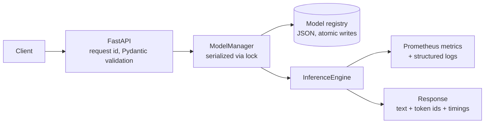

# Architecture

End-to-end structure of JAXScale-LM. Code references are package-relative
under `src/jaxscale_lm/`. The measured behavior of these flows (compile
cost, prefill/decode latency, cache speedup) lives in
[results.md](results.md); how those numbers are produced is in
[benchmarking.md](benchmarking.md).

## Component map

| Layer | Modules | Responsibility |
|---|---|---|
| config | `config.py` | typed, validated YAML configuration (single source of truth) |
| data | `data/` | sources → tokenizer → packing → deterministic batching |
| model | `model/` | NNX decoder-only Transformer + fixed-capacity KV cache |
| training | `training/` | loss, optimizer, jitted step, eval, Orbax checkpoints, trainer |
| distributed | `distributed/` | mesh, named shardings, placement, diagnostics |
| inference | `inference/` | sampling, prefill, decode, generation engine |
| serving | `serving/` | FastAPI app, registry, lifecycle, Prometheus metrics |
| benchmark | `benchmark/` | suites, schema, runner, plots, memory probe |

## Training flow

```mermaid
flowchart LR
    DS[Dataset<br/>synthetic / local / TinyStories] --> TOK[Tokenizer<br/>byte or BPE]
    TOK --> PACK[Sequence packer<br/>concat + chunk seq+1]
    PACK --> LOAD[Host loader<br/>deterministic shuffle]
    LOAD --> SHARD[place_batch<br/>P&#40;None, data, None&#41;]
    SHARD --> STEP[jitted train step<br/>grad + accumulate &#40;scan&#41;]
    STEP --> OPT[AdamW + clip + schedule]
    OPT --> METRICS[metrics<br/>loss / acc / grad-norm / lr]
    STEP -. every interval .-> EVAL[jitted eval step<br/>token-weighted aggregation]
    EVAL --> CKPT[Orbax CheckpointManager<br/>params + opt + step + RNG + metadata]
```



The trainer ([training/trainer.py](../src/jaxscale_lm/training/trainer.py))
is the only place where host I/O, logging, device placement, and the jitted
step meet. The step function itself
([training/step.py](../src/jaxscale_lm/training/step.py)) is pure:
`(TrainState, Batch) -> (TrainState, metrics)`.

## Inference flow

```mermaid
flowchart LR
    P[Prompt] --> ENC[Tokenizer.encode]
    ENC --> PRE[Prefill &#40;jit&#41;<br/>whole prompt, one pass]
    PRE --> KV[KV cache<br/>fixed capacity, indexed writes]
    KV --> DEC[Decode step &#40;jit&#41;<br/>1 token, reads cache]
    DEC --> SAMP[Sampler<br/>greedy / temp / top-k / top-p]
    SAMP -->|next token| DEC
    SAMP -->|EOS or max| TXT[Tokenizer.decode]
```



Prefill and decode are separate jitted functions with separate shapes
(prefill keyed by prompt length; decode compiled once because cache
capacity is pinned to the model context). The naive path (full-prefix
recompute in a fixed buffer) exists solely for honest comparison.

## Serving flow



Startup loads a checkpoint and **warms up the compiled decode path before
`/ready` reports ready** ([serving/lifecycle.py](../src/jaxscale_lm/serving/lifecycle.py)).

## Distributed layout

```mermaid
flowchart TB
    PROC[Host process] --> D0[(device 0)]
    PROC --> D1[(device 1)]
    PROC --> DN[(device N-1)]
    subgraph MESH[Logical mesh axes: data x model]
        D0 --- D1 --- DN
    end
    PARAMS[Parameters / opt state<br/>P&#40;&#41; replicated] -.-> MESH
    BATCH[Train batch<br/>P&#40;None, data, None&#41;] -.-> MESH
```



## Checkpoint lifecycle

1. Trainer saves every `checkpoint.interval_steps` via Orbax
   `CheckpointManager` (async; atomic directory commit).
2. Each step directory holds the `state` pytree (params, optimizer state,
   step, RNG key data) and a `metadata` JSON (resolved config, tokenizer
   info, parameter count, best metric, versions, timestamp).
3. Retention: `max_to_keep`, optionally ranked by best validation loss.
4. Restore validates the stored model config against the current one and
   refuses mismatches with a field-level diff.
5. Every exit path calls `wait_until_finished()` so async saves are durable.

## Model registry lifecycle

```
REGISTERED -> LOADING -> READY -> UNLOADED
                  |          \-> LOADING (reload)
                  \-> FAILED -> LOADING (retry)
```

Transitions outside this graph raise; the registry persists to JSON with
write-temp + `os.replace` atomicity
([serving/registry.py](../src/jaxscale_lm/serving/registry.py)).
