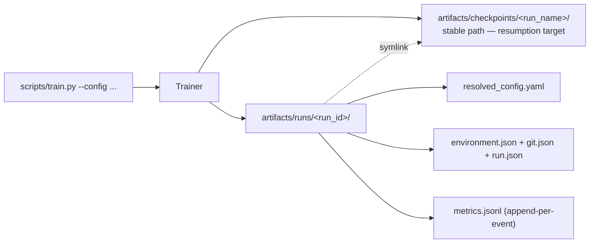

# Reproducibility

What it takes to re-run any experiment in this repository and get the same
answer.

## Seeds

One integer (`project.seed`) drives everything:

- **JAX PRNG**: the root key (`jax.random.key(seed)`) lives in `TrainState`
  and is checkpointed. Per-step dropout keys are derived with
  `fold_in(root, step)` — the root is never consumed, so a resumed run at
  step N continues the exact stream of an uninterrupted run.
- **Host randomness** (shuffling, synthetic data, document splits) uses
  numpy generators derived from `(seed, stream_name)` via a *stable* CRC32
  hash ([seed.py](../src/jaxscale_lm/utils/seed.py)) — Python's built-in
  `hash()` is randomized per process and is deliberately avoided.
- **Sampling**: generation takes an explicit `seed`; greedy decoding is
  bit-deterministic for a fixed checkpoint and prompt (regression-tested).

Epoch shuffles derive from `(seed, epoch)`, and the loader can fast-forward
to any step, which is what makes exact checkpoint resumption testable.

## Environment lock

- `pyproject.toml` declares dependencies; **`uv.lock`** pins the full
  resolved graph. `uv sync --frozen` reproduces the environment exactly.
- Supported Python: 3.12 (managed by uv; declared `>=3.11,<3.13`).
- The Dockerfile builds from the same lock file.

## Dataset and tokenizer versions

- The synthetic corpus is generated from the seed — fully reproducible with
  no external state.
- TinyStories is loaded via Hugging Face Datasets
  (`roneneldan/TinyStories`, `train` split) into a pinned `cache_dir`;
  `data.max_train_documents` caps the slice deterministically.
- The byte tokenizer has no trained state (fixed 259-entry vocab, ids
  documented in [tokenizer.py](../src/jaxscale_lm/data/tokenizer.py)).
- Trained BPE tokenizers are saved as a single JSON file whose path and
  declared vocab size are validated against the config at load time, and
  recorded in checkpoint metadata.

## Configuration capture

Every training run writes `resolved_config.yaml` — the *fully merged*
configuration after `defaults` composition — into its checkpoint directory.
Every benchmark run writes the same next to its records. Restoring a
checkpoint validates the stored model config against the current one and
refuses silently-incompatible restores.

## Run manifests

Every trainer invocation (training *and* checkpoint-based evaluation, since
both go through `Trainer`) writes a self-contained audit trail under
`artifacts/runs/<run_id>/` ([run_manifest.py](../src/jaxscale_lm/utils/run_manifest.py)):



```text
artifacts/runs/<run_id>/
  resolved_config.yaml   exact configuration the run executed with
  environment.json       Python/JAX/jaxlib/Flax/Optax/Orbax versions, backend, devices
  git.json               commit, dirty flag, branch (null outside a git repo)
  run.json               run id/name, argv, seed, checkpoint directory
  metrics.jsonl          one JSON line per event: trainer_initialized,
                         resumed, train_step (loss/accuracy/grad_norm/lr/
                         tokens_per_s), evaluation, final_evaluation
  checkpoints            symlink to the stable checkpoint directory
```

Checkpoints deliberately live *outside* the run directory (at
`<artifacts_dir>/checkpoints/<run_name>`) because resumption must find them
across invocations; each invocation is its own run, and `run.json` plus the
symlink record the linkage. Benchmark runs write the analogous layout under
`artifacts/benchmarks/<run_id>/` (see [benchmarking.md](benchmarking.md));
their environment/git capture is embedded in every record. Manifest writing
is covered by `tests/integration/test_run_manifest.py`.

## Git and version capture

Benchmark records embed the git commit, a dirty-tree flag, and the versions
of jax/jaxlib/flax/optax/orbax plus Python; training runs capture the same
in `environment.json`/`git.json`. Checkpoint metadata records the
jaxscale-lm and jax versions and the creation timestamp.

## Checkpoint completeness

A checkpoint contains parameters, optimizer state, step counter, the root
RNG key, the resolved config, tokenizer metadata, parameter count, and the
best-metric value — enough for the exact-resumption integration test
(`tests/integration/test_train_checkpoint.py`) to verify that
train-N → save → restore → train-M equals train-(N+M) on parameters,
optimizer state, and evaluation loss.

## Known reproducibility boundaries

- Bitwise results are tied to the locked library versions and platform;
  XLA may legally reorder float reductions across versions/backends.
  Tolerances in tests document the expected drift (typically ≤ 1e-5
  relative for float32).
- Wall-clock numbers are obviously machine-specific; see
  [benchmarking.md](benchmarking.md) for the disclosure rules.
