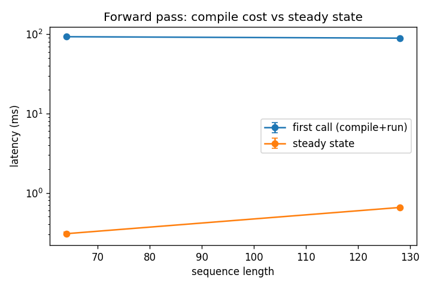
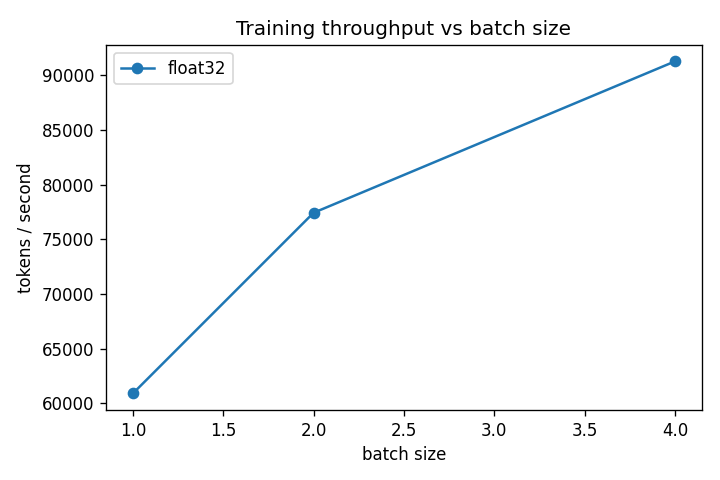
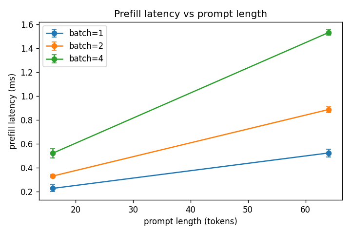
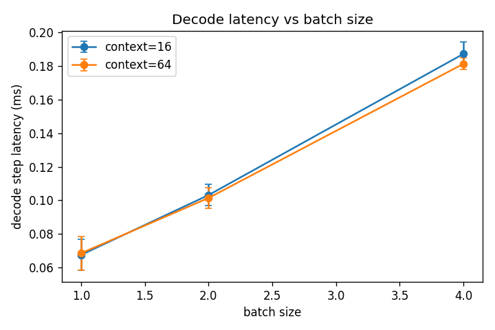
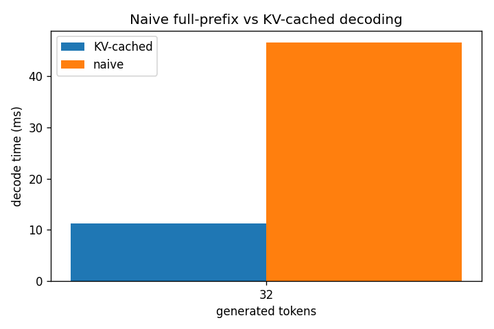
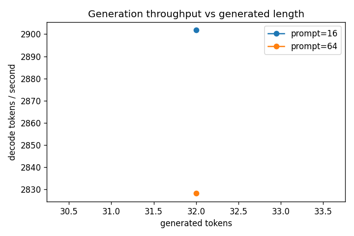

# Results

> **Rule for this file**: every number here is copied from a real benchmark
> run produced by `scripts/benchmark.py` on the disclosed hardware. Nothing
> is estimated. The raw evidence for the run cited below is committed under
> [docs/benchmarks/20260611_085752_0eb57a/](benchmarks/20260611_085752_0eb57a/)
> (records JSONL, CSV/Markdown summaries, resolved config, plots).

## Run provenance

- Run ID: `20260611_085752_0eb57a` (2026-06-11)
- Command: `uv run python scripts/benchmark.py --config configs/benchmark/default.yaml`
- Git: `7dfa39040182ebc09189774757adc79b025163a7` (dirty working tree —
  benchmark ran during pre-commit verification of this revision)
- Versions: Python 3.12.13, jax 0.10.1, flax 0.12.7, optax 0.2.8, orbax 0.12.0
- Records: 29 ok, 0 failed; warmup 3, measured 10 iterations per steady-state
  timing (5 for full-generation loops); raw samples preserved in
  [records.jsonl](benchmarks/20260611_085752_0eb57a/records.jsonl).

## Hardware disclosure

- **Platform: CPU only.** Apple Silicon (arm64), macOS 26.5.1, 1 JAX device,
  1 process. There is no GPU or TPU in this environment.
- These numbers characterize *relative* systems behavior (compile vs steady
  state, cached vs naive decode, batch scaling) of a tiny model on CPU. They
  are **not** accelerator performance claims and do not transfer to GPU/TPU.
- **Multi-device scaling: not measured.** Only one real device is available.
  Data-parallel sharding logic is exercised under simulated CPU devices in
  tests (`XLA_FLAGS=--xla_force_host_platform_device_count=8`), which is
  suitable for correctness only — simulated devices share one CPU and say
  nothing about scaling. See docs/limitations.md.

## Workload

Tiny preset: 2 layers, hidden 64, 4 heads, vocab 259, float32 — 115,200
trainable parameters (`parameter_count` in this run's records). Sequence
lengths 64/128, batch sizes 1/2/4, prompts 16/64, 32 generated tokens.

## Experiment 1 — JIT benefit (forward pass, batch 4)

| seq | eager median | first jitted call | warmed jitted call | first/steady |
|---|---|---|---|---|
| 64  | 3.65 ms | 93.09 ms | 0.31 ms | 304.5× |
| 128 | 3.63 ms | 89.30 ms | 0.65 ms | 136.5× |

Compilation dominates the first call by two orders of magnitude; the warmed
jitted path is ~6–12× faster than eager dispatch. Timing uses
`block_until_ready` on every sample.

## Experiment 2 — Shape recompilation

| call | batch | seq | recompiled? | wall time |
|---|---|---|---|---|
| repeat of seen shape | 1 | 64 | no | 0.34 ms |
| repeat of seen shape | 1 | 128 | no | 0.63 ms |
| new batch size | 2 | 64 | **yes** | 100.0 ms |

Re-invoking with a previously traced shape hits the executable cache; any
new (batch, seq) pair pays a fresh ~100 ms compile. Detected via the
process-global compile counter (`utils/timing.compilation_count`).

## Experiment 3 — Training throughput and gradient accumulation

| step | median latency | tokens/s |
|---|---|---|
| batch 1, no accumulation | 1.05 ms | 60,894 |
| batch 2, no accumulation | 1.65 ms | 77,420 |
| batch 4, no accumulation | 2.80 ms | 91,270 |
| batch 4 as 2×2 accumulation | 3.17 ms | 80,681 |

Throughput grows sublinearly with batch size (tiny model: dispatch overhead
amortizes but compute saturates). Accumulating 2 microbatches of 2 costs
~13% throughput versus one physical batch of 4 — the price of the scan and
extra optimizer bookkeeping. Update *equivalence* of the two is asserted
numerically in `tests/unit/test_training.py::TestGradientAccumulation`.
Device-memory savings are not measurable on the CPU backend (see
docs/limitations.md); only host RSS is available.

## Experiment 4 — Precision

Only float32 was swept in this run: bfloat16 on this CPU backend is
emulated, so its throughput is not representative of accelerator behavior
and reporting it as a "precision speedup" would be misleading. bfloat16
*correctness* is covered by unit tests.

## Experiment 5 — KV cache vs naive decoding (prompt 16, 32 new tokens, batch 1)

| decoder | decode time (median) | ms/token |
|---|---|---|
| KV-cached | 11.24 ms | 0.4 |
| naive full-prefix | 46.58 ms | 1.5 |

**4.1×** faster decode from the fixed-capacity cache at only 32 generated
tokens over a 16-token prompt; the gap widens with longer prefixes since
naive decode re-runs the full prefix every step (O(n²) vs O(n)).

## Experiment 6 — Batch scaling

Prefill latency (median):

| batch | prompt 16 | prompt 64 |
|---|---|---|
| 1 | 0.23 ms | 0.52 ms |
| 2 | 0.33 ms | 0.89 ms |
| 4 | 0.52 ms | 1.53 ms |

Single-token decode step (median):

| batch | ctx 16 | ctx 64 | aggregate tokens/s (ctx 64) |
|---|---|---|---|
| 1 | 0.07 ms | 0.07 ms | 14,585 |
| 2 | 0.10 ms | 0.10 ms | 19,717 |
| 4 | 0.19 ms | 0.18 ms | 22,066 |

Decode latency is insensitive to cache fill (fixed-shape cache reads the
full capacity either way) and batching raises aggregate throughput at
modest per-step cost.

## End-to-end generation (batch 1, 32 new tokens)

| prompt | time to first token | total | generated tokens/s |
|---|---|---|---|
| 16 | 0.21 ms | 11.24 ms | 2,902 |
| 64 | 0.56 ms | 11.88 ms | 2,828 |

Time-to-first-token tracks prefill (longer prompt → slower first token);
steady decode throughput is essentially prompt-independent.

## Experiment 7 — Data parallelism

Not measured: this environment has one real device. The data-parallel path
is implemented and correctness-tested under simulated CPU devices; no
scaling numbers are reported because none were (or could honestly be)
measured here.

## Plots

Rendered from this run, committed under
[docs/benchmarks/20260611_085752_0eb57a/plots/](benchmarks/20260611_085752_0eb57a/plots/):

